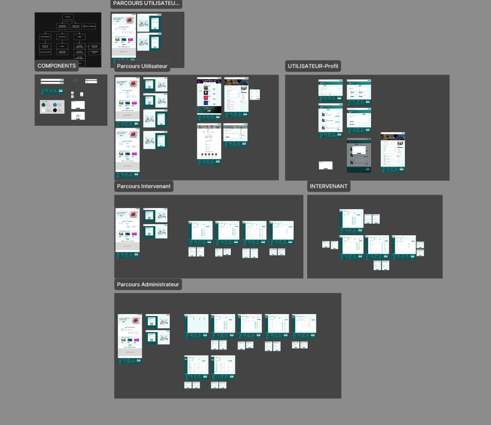

# Description du dépôt

*   **Le lien du site** : [txl-forma.vercel.app](https://txl-forma.vercel.app)
*   **Le lien Figma** : [Maquettes, Design System & Prototypage](https://www.figma.com/design/brMxnpRyxYbKdUEg7ScYlm/SAE_501?node-id=0-1&t=wwLwyr7fAHJVvndl-1)
*   **L'API** : [Voir le dossier Backend](backend/)
*   **La BDD SQL** : MySQL (Configurée dans le backend Spring Boot)
*   **Le code complet** : [Racine du dépôt](./)
*   **Le compte rendu de la SAE** : [Dossier de cadrage](autres%20rendus/SAE501_Cadrage_CAMELIN_SOM_LOPERE_RAKOTOMAVO.pdf)
*   **Les diagrammes** : [Voir les schémas techniques](#schémas-techniques) (MCD, UML, Architecture)

### 🔑 Identifiants pour tests

> Pour tester les différents rôles sur le site :

| Rôle | Identifiant | Mot de passe |
| :--- | :--- | :--- |
| **Admin** | `admin` | `1234` |
| **Formateur** | `la.patrick` | `1234` |
| **Étudiant** | `yohan` | `azerty` |

## ✨ Fonctionnalités Clés

### 🏠 Expérience Utilisateur (Front-Office)
*   **Accueil Immersif 3D** : Intégration d'une scène 3D interactive (Three.js / React Three Fiber) représentant une salle de classe virtuelle.
*   **Catalogue de Formations** : Filtrage dynamique par domaines et durée.
*   **Espace Étudiant** :
    *   Tableau de bord personnel.
    *   Suivi des formations en cours.
    *   Téléchargement de certificats (génération PDF).
    *   Gestion du profil et sécurité.

### 🛠 Espace Administration (Back-Office)
*   **Dashboard Admin** : Vues statistiques et gestion globale (CRUD Formations, Utilisateurs, Formateurs).
*   **Espace Formateur** :
    *   Gestion des sessions assignées.
    *   Suivi des participants et émargement.

---

## 💻 Stack Technique

### Frontend
*   **Framework** : [React 19](https://react.dev/) + [Vite](https://vitejs.dev/)
*   **UI/UX** : [Bootstrap 5](https://getbootstrap.com/), [React-Bootstrap](https://react-bootstrap.github.io/), CSS3 custom properties.
*   **3D & Interactif** : [Three.js](https://threejs.org/), [@react-three/fiber](https://docs.pmnd.rs/react-three-fiber), [@react-three/drei](https://github.com/pmndrs/drei).
*   **Utilitaires** :
    *   `react-router-dom` pour le routing.
    *   `jspdf` pour la génération de diplômes.
    *   `font-awesome` pour les icônes.

### Backend
*   **Langage** : Java 21
*   **Framework** : Spring Boot
*   **Base de données** : MySQL
*   **Architecture** : REST API, JPA/Hibernate.

---

## 📂 Documentation & Rendus

### Documents de conception
*   📄 [**Cahier des charges (CDC)**](autres_rendus/CDC_SAE501_CAMELIN_SOM_RAKOTOMAVO_LOPERE.pdf)
*   📑 [**Dossier de cadrage**](autres_rendus/SAE501_Cadrage_CAMELIN_SOM_LOPERE_RAKOTOMAVO.pdf)
*   🧊 [**Fichier source 3D (.blend)**](autres_rendus/SCENECLASSE.blend)

### Schémas Techniques
| Architecture | UML | Maquette |
|:---:|:---:|:---:|
|  |  |  |

---

## 🛠 Installation Locale

Si vous souhaitez lancer le projet sur votre machine :

### 1. Cloner le dépôt
```bash
git clone https://github.com/yoh4nyo/TXL_FORMA.git
cd TXL_FORMA
```

### 2. Installation des dépendances (Frontend)
```bash
npm install
```

### 3. Lancer le serveur de développement
```bash
npm run dev
```
> Le site sera accessible sur `http://localhost:5173`.

---

## 👥 Auteurs

Projet réalisé par l'équipe **TXL** :
*   **CAMELIN**
*   **SOM**
*   **RAKOTOMAVO**
*   **LOPERE**

---
*© 2025 TXL FORMA - Tous droits réservés.*
