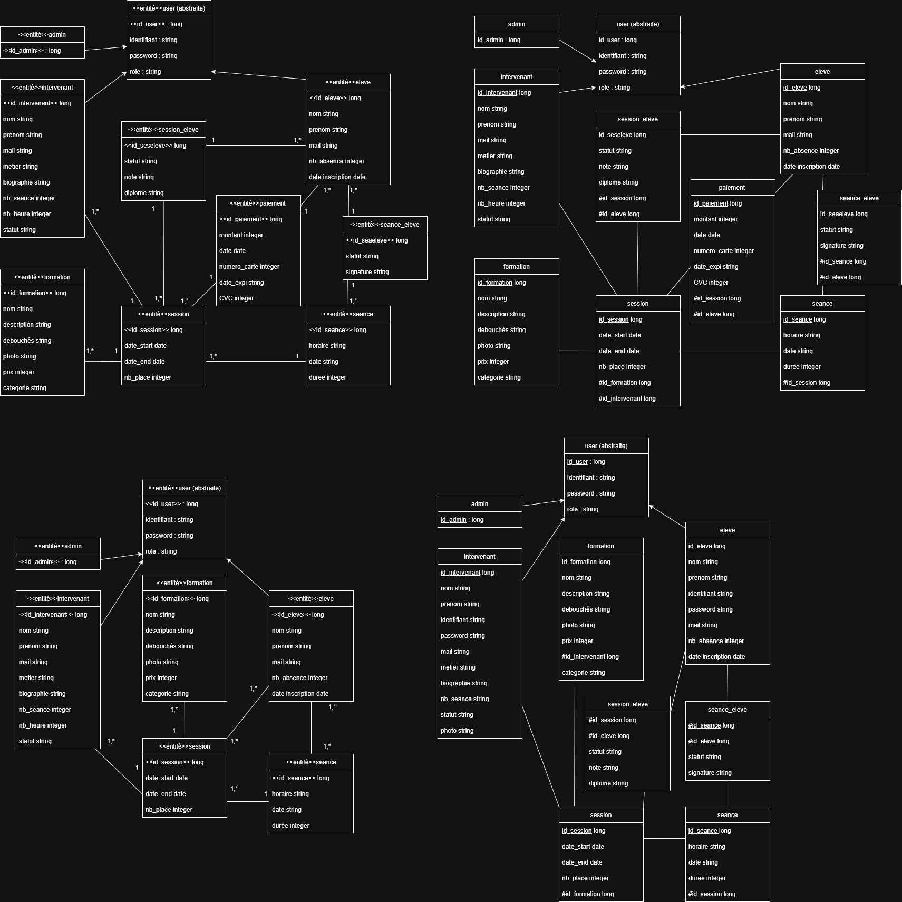
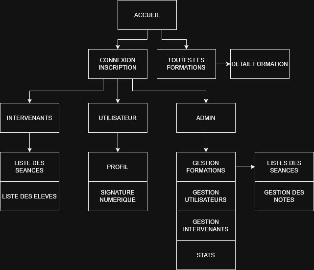
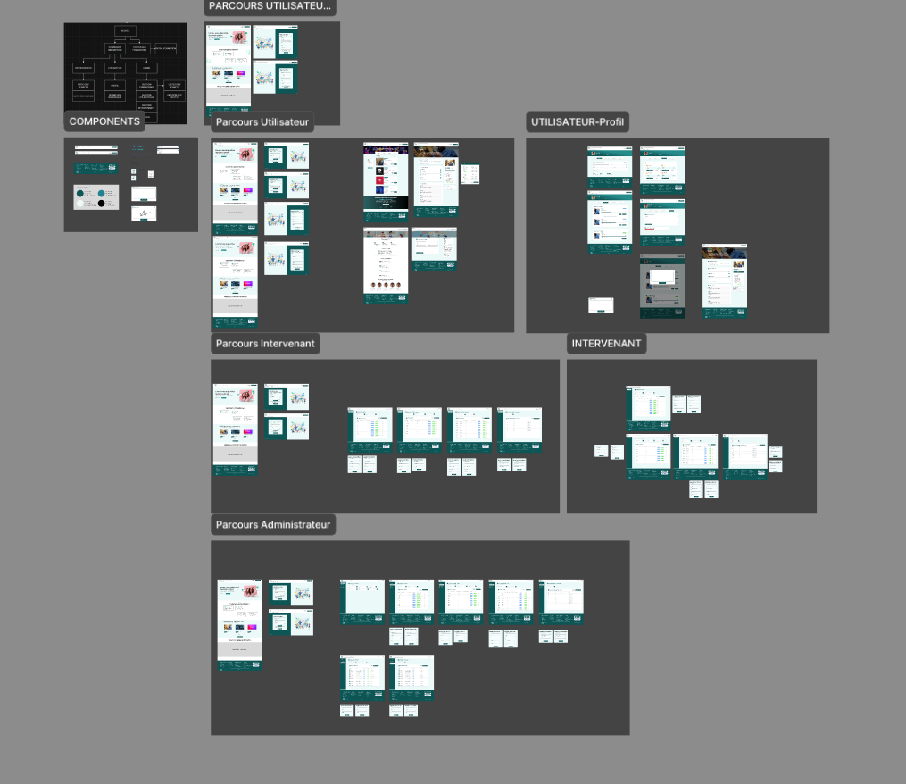

# Projet TXL FORMA

### 1. Documents et informations supplémentaires
> *Cette section contient tout document de nature à apporter des informations supplémentaires sur les différentes parties du projet (Partie mobile, 3D, …).*

*   **(À compléter : Ajouter ici les descriptions ou liens vers les documents 3D, Mobile, etc.)**

---

### 2. Schémas conceptuels

#### Diagramme UML


#### Architecture fonctionnelle


#### Maquette

*   [**Accéder à la maquette figma**](https://www.figma.com/design/brMxnpRyxYbKdUEg7ScYlm/SAE_501?node-id=0-1&t=wwLwyr7fAHJVvndl-1)


---

### 3. Lien github
> *Lien vers la première version du code.*

*   [**Lien vers le dépôt Github**](https://github.com/yoh4nyo/TXL_FORMA) *(Vérifiez que ce lien est correct)*

---

## Installation et lancement du projet

Ce projet utilise React + Vite.

### Prérequis
- Node.js installé

### Installation
```bash
npm install
```

### Lancement
```bash
npm run dev
```
